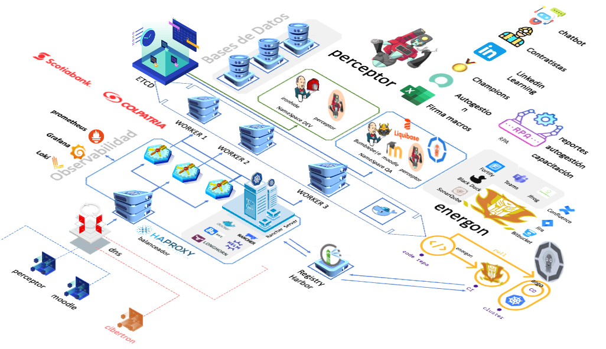

# Framework DevSecOps

Implementar prácticas DevSecOps para que los equipos de desarrollo, seguridad y operaciones trabajen colaborativamente para construir, probar, implementar y monitorear aplicaciones con velocidad, calidad y control.

Hoy el estilo de trabajo DevSecOps tiene su propio framework que permite utilizar las capacidades de la automatización para apalancar las soluciones de pipeline y mejora de procesos que hoy tiene a su cargo.

Utilizamos tecnologías de bajo costo y probadas por diferentes comunidades y organizaciones, agnósticas y portables, adaptables a cualquier plataforma.

## infraestructura como codigo

### docker-compose

Compose es una herramienta para definir y ejecutar aplicaciones Docker de varios contenedores. Con Compose, utiliza un archivo YAML para configurar los servicios de su aplicación. Luego, con un solo comando, crea e inicia todos los servicios desde su configuración. Para obtener más información sobre todas las funciones de Compose, consulte la lista de funciones.

## Energo

| Herramienta         | Descripcion                                                                                                      |
| ------------------- | ---------------------------------------------------------------------------------------------------------------- |
| Bitbucket           | Repositorio de Aplicaciones e Infraestructura, acciones habilitadas por energon son crear tag, diff, eliniar tag |
| Teams               | Notificaciones en Canales de Teams de Microsoft                                                                  |
| Sonarqube           | Analisis de Codigo Estatico                                                                                      |
| Black Duck          | Analisis de Codigo Estatico                                                                                      |
| Fortify             | Analisis de Codigo con validaciones de reglas                                                                    |
| Compress            | Compresion de archivos de Windows (zip) y Linux (tar))                                                          |
| Jira                | Reporte de Tareas, estados y actualizaciones de tareas ejecutadas por el pipeline                                |
| Jfrog Artifactory   | Subir archivos repositorio de artefactos                                                                         |
| Deploy              | Step de CD de despliegue para las aplicaciones                                                                   |
| Identity Enviroment | Sterp definido para obtener variables en agentes remotos o compilación de                                       |

# Framework

Perceptor, Energon, RPA, k8s

